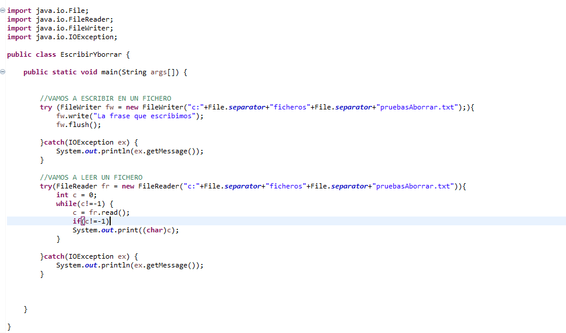
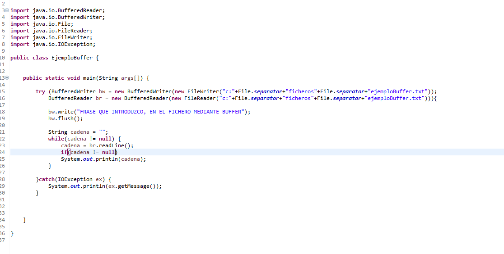
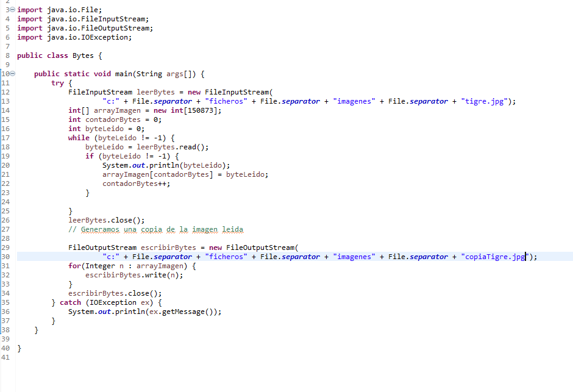

## Índice
[Introducción](#introducción)  

[Leer-Y-Escribir-Caracteres](#leer-y-escribir-caracteres)  

[Sobre-Buffer](#sobre-buffer)

[Escribir-y-Leer-Bytes](#escribir-y-leer-bytes)

## Introducción  
Existen dos tipos de flujos:  

- Los __flujos de caracteres__ (16 bits) se usan para manipular __datos legibles por humanos__ (ficheros de texto). Vienen determinados por dos clases abstractas: __Reader__ y __Writer__  
- Los __flujos de bytes__ (8 bits) se usan para manipular __datos binarios__, __legibles solo por la máquina__. Vienen determinados por dos clases abstractas __InputStream__ y __OutputStream__.  

Cuando se va a hacer uso de ficheros, hay que tener en cuenta, la forma de acceso: __secuencial__ o __aleatoria__.  
- __secuencial__ Para acceder a un dato debemos recorrer todo el fichero desde el principio hasta llegar a su posición.  
- __aleatoria__ Podemos posicionarnos directamente en una posición del fichero, y ahí leer o escribir.  

Un __Buffer__ es una especie de memoria interna que se coloca entre medias de nuestro programa java y el archivo externo.  
El objetivo de la memmoria intermedia es: En lugar de acceder directamente desde nuestro código java al archivo, lo hagamos a esta memoria intermedia, de manera que:  
- La información contenida en el archivo de texto se vuelca COMPLETAMENTE al Buffer, se almacena en ese Buffer y una vez que la información del archivo está integramente en el Buffer, es nuestro programa java, quien accede a ese Buffer para ir descargando poco a poco esa información. Des este modo se gana en rapidez y eficiencia.  
El Buffer lo podemos usar tanto para escribir como para leer información de un fichero externo (BufferReader - BufferWriter).  
## Leer y Escribir Caracteres
En este ejemplo utilizamos try-with-resources  
- Como ventaja, no tenemos que cerrar el fichero, se hace automáticamente.
- Emplear el método flush(), nos evita la pérdida de información.
  

## Sobre Buffer  
En este ejemplo, volvemos a utilizar try-with-resources.  
De manera que no tenemos que cerrar ninguna de las dos conexiones con los ficheros de entrada o salida.
  

## Escribir y Leer Bytes  
Para leer y escribir bytes, utilizaremos: __FileInputStream__ y __FileOutputStream__ .  
En este ejemplo, dada una imagen en una ruta determinada, crearemos un array con los bytes de la misma y a continuación generaremos una copia. 
  