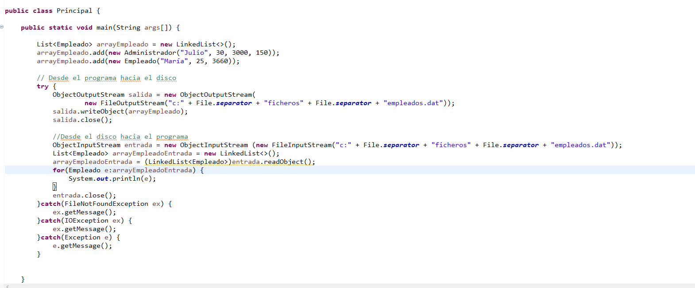

## Índice
[Introducción](#introducción)  

[Leer-Y-Escribir-Caracteres](#leer-y-escribir-caracteres)  

[Sobre-Buffer](#sobre-buffer)

[Escribir-y-Leer-Bytes](#escribir-y-leer-bytes)  

[Acceso-Aleatorio](#acceso-aleatorio)  

[Serialización](#serialización)

## Introducción  
Existen dos tipos de flujos:  

- Los __flujos de caracteres__ (16 bits) se usan para manipular __datos legibles por humanos__ (ficheros de texto). Vienen determinados por dos clases abstractas: __Reader__ y __Writer__  
- Los __flujos de bytes__ (8 bits) se usan para manipular __datos binarios__, __legibles solo por la máquina__. Vienen determinados por dos clases abstractas __InputStream__ y __OutputStream__.  

Cuando se va a hacer uso de ficheros, hay que tener en cuenta, la forma de acceso: __secuencial__ o __aleatoria__.  
- __secuencial__ Para acceder a un dato debemos recorrer todo el fichero desde el principio hasta llegar a su posición.  
- __aleatoria__ Podemos posicionarnos directamente en una posición del fichero, y ahí leer o escribir.  

Un __Buffer__ es una especie de memoria interna que se coloca entre medias de nuestro programa java y el archivo externo.  
El objetivo de la memmoria intermedia es: En lugar de acceder directamente desde nuestro código java al archivo, lo hagamos a esta memoria intermedia, de manera que:  
- La información contenida en el archivo de texto se vuelca COMPLETAMENTE al Buffer, se almacena en ese Buffer y una vez que la información del archivo está integramente en el Buffer, es nuestro programa java, quien accede a ese Buffer para ir descargando poco a poco esa información. Des este modo se gana en rapidez y eficiencia.  
El Buffer lo podemos usar tanto para escribir como para leer información de un fichero externo (BufferReader - BufferWriter).  
## Leer y Escribir Caracteres
En este ejemplo utilizamos try-with-resources  
- Como ventaja, no tenemos que cerrar el fichero, se hace automáticamente.
- Emplear el método flush(), nos evita la pérdida de información.
  

## Sobre Buffer  
En este ejemplo, volvemos a utilizar try-with-resources.  
De manera que no tenemos que cerrar ninguna de las dos conexiones con los ficheros de entrada o salida.
  

## Escribir y Leer Bytes  
Para leer y escribir bytes, utilizaremos: __FileInputStream__ y __FileOutputStream__ .  
En este ejemplo, dada una imagen en una ruta determinada, crearemos un array con los bytes de la misma y a continuación generaremos una copia.  

  

## Acceso Aleatorio  
La clase RandomAccesFile nos permite leer y escribir archivos de manera aleatoria, es decir, nos podemos situar en una posición concreta, en lugar de tener que recorrer desde el principio todo el fichero.  
Hay que tener en cuenta que cada tipo de variable ocuma un número de bytes.
Long = 8 bytes.  
Double = 8 bytes.  
Integer = 4 bytes.  
Float = 4 bytes.  
Short = 2 bytes.  
Char = 2 bytes.  
String = 2 bytes (por cada caracter).  
Byte = 1 byte.
Boolean = 1 byte.  

Es importante calcular el número de bytes, ya que si no lo sabemos, dificilmente podremos situarnos con precisión en la posición requerida.  

  

## Serialización  

Serializar consiste en convertir un objeto que podemos haber creado nosotros con un programa java, en una sucesión de bytes.  
Con el objetivo de poder almacenar ese objeto en un medio de almacenamiento (disco duro, pen drive) y en el futuro restaurar o recomponer ese objeto al estado en el que se encontraba cuando lo serializamos.  
Serializar = convertir en bytes.  
La serialización se utiliza en java, con el objetivo, de que ese objeto que hemos convertido en bytes, distribuirlo a través de la red a ordenadores remotos y que en esos ordenadores remotos pues ese objeto sea reestablecido al estado en el que se encontraba cuando se serializó.  
¿Qué clases necesitamos en java para realizar ésta tarea?  
- La interfaz: Serializable, aquellas clases que la implementen, le estaremos diciendo a java, que son susceptibles de ser convertidas en bytes para transferirlas a la red, ordenadores remotos o guardarlos en el disco duro.  
- Además de la interfaz Serializable, necesitaremos __ObjectOutputStream__ y __ObjectInputStream__.

  
  
  

